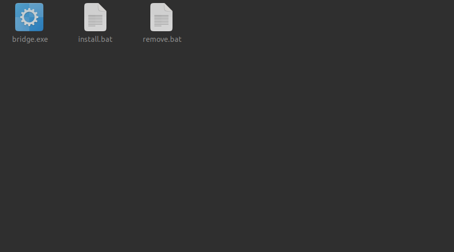
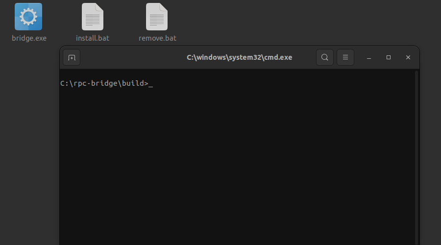
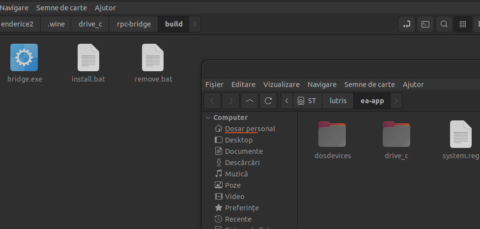
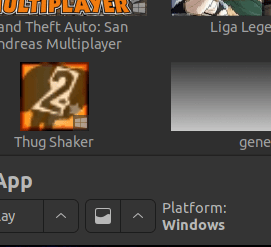
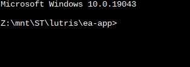
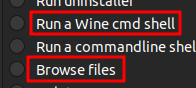
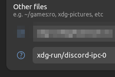
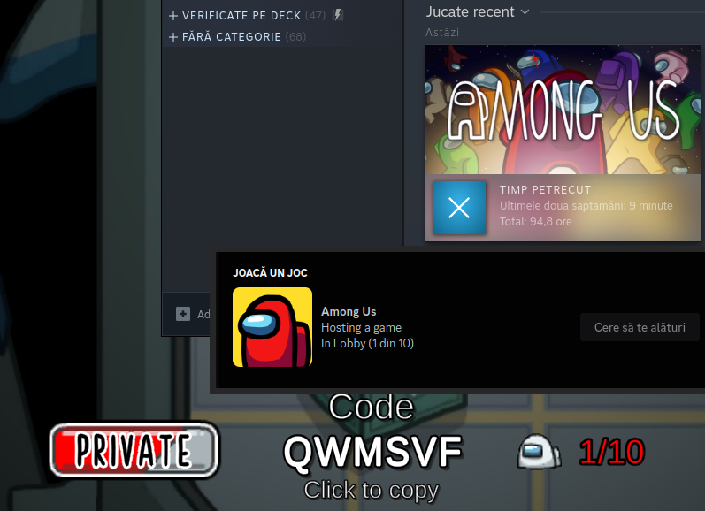

# Discord RPC Bridge for Wine

Simple bridge that allows you to use Discord Rich Presence with Wine games/software.

Works by running a small program in the background that creates a [named pipe](https://learn.microsoft.com/en-us/windows/win32/ipc/named-pipes) `\\.\pipe\discord-ipc-0` inside the prefix and forwards all data to the pipe `/run/user/1000/discord-ipc-0`.

This bridge takes advantage of the Windows service implementation in Wine, eliminating the need to manually run any programs.

---

## Table of Contents

- [Discord RPC Bridge for Wine](#discord-rpc-bridge-for-wine)
	- [Table of Contents](#table-of-contents)
	- [Installation \& Usage](#installation--usage)
		- [Installing inside a prefix](#installing-inside-a-prefix)
			- [Wine (~/.wine)](#wine-wine)
			- [Lutris](#lutris)
			- [Steam](#steam)
		- [If you use Flatpak](#if-you-use-flatpak)
	- [Run without installing the service](#run-without-installing-the-service)
	- [About macOS](#about-macos)
	- [Compiling from source](#compiling-from-source)
	- [Command line arguments](#command-line-arguments)
	- [Debugging](#debugging)
	- [Demo](#demo)
	- [Credits](#credits)

## Installation & Usage

Installation will place `bridge.exe` to `C:\bridge.exe` (if it's not already there) and create a Windows service. This service will automatically start when the prefix is used.

If you prefer not to use the service for any reason, please refer to the [Run without installing the service](#run-without-installing-the-service) section.

#### Installing inside a prefix

##### Wine (~/.wine)

- Open terminal in `build`
- Run `$ wine cmd` and `C:\> install.bat`
	- 
- To remove, run `C:\> remove.bat`
	- 
- Note: Copying files are not required here.

##### Lutris

- Right click on the game and select `Browse files`
	- 
- Copy contents of `build` to the game's prefix `drive_c`
	- 
- To install open the console
	- 
- And run `C:\> install.bat` (make sure you are in `C:\`!)
	- 

##### Steam

- Open [Protontricks](https://github.com/Matoking/protontricks) and select the game you want to install the bridge to
- Select `Select the default wineprefix`
- Select `Browse files` and copy contents of `build` to the game's prefix `drive_c`
- Select `Run a Wine cmd shell` and run `C:\> install.bat`
	- If you are not in `C:\`, type `c:` and press enter
- 

#### If you use Flatpak

- If you are running Steam, Lutris, etc. in a Flatpak, you will need to allow the bridge to access the `/run/user/1000/discord-ipc-0` file.
	- ##### By using [Flatseal](https://flathub.org/apps/details/com.github.tchx84.Flatseal)
		- Add `xdg-run/discord-ipc-0` under `Filesystems` category
		- 
	- ##### By using the terminal
		- Per application
			- `flatpak override --filesystem=xdg-run/discord-ipc-0 <flatpak app name>`
		- Globally
			- `flatpak override --user --filesystem=xdg-run/discord-ipc-0`

## Run without installing the service

If you prefer not to use the service, you can manually run `bridge.exe` within the Wine prefix.
This method is compatible with both Wine and Lutris.

In Lutris, you can achieve this by adding the path to `bridge.exe` in the `Executable` field under `Game options`. In `Arguments`  field, be sure to include the _Windows_ path to the game's executable.
Example:
- Without bridge:
	- Executable `/mnt/games/lutris/league-of-legends/drive_c/Riot Games/League of Legends/LeagueClient.exe`
	- Arguments `--locale=en_US --launch-product=league_of_legends --launch-patchline=live`
- With bridge:
	- Executable `/mnt/games/lutris/league-of-legends/drive_c/bridge.exe`
	- Arguments `"C:\Riot Games\League of Legends\LeagueClient.exe" --locale=en_US --launch-product=league_of_legends --launch-patchline=live`

In Wine, all you need to do is run `bridge.exe`.

- When running the program manually without providing any arguments, it will simply initiate the bridge and wait indefinitely until it's closed.

## About macOS

The bridge works similarly on macOS as it does on Linux, but it can't be registered as a service due to TMPDIR limitations. macOS users must manually run `bridge.exe` when needed.

To run `bridge.exe` on macOS, navigate to its directory in the terminal and execute `wine bridge.exe`. (or double click it in the Finder)

## Compiling from source

- Install the `wine`, `x86_64-w64-mingw32-gcc` and `make` packages.
- Open a terminal in the directory that contains this file and run `make`.
- The compiled executable will be located in `build/bridge.exe`.

## Command line arguments

- `--install` - Installs the service
- `--remove` - Removes the service
- `--service` - Reserved for the service
- `[Target Executable]` - Starts the bridge and the game
	- Example: `bridge.exe "C:\Riot Games\League of Legends\LeagueClient.exe" --locale=en_US --launch-product=league_of_legends --launch-patchline=live`
	- Note: The game executable must be enclosed in quotes. The rest of the arguments are passed to the target executable.

## Debugging

The bridge will write the logs in `C:\bridge.log`.

## Demo

## Credits

This project is inspired by [wine-discord-ipc-bridge](https://github.com/0e4ef622/wine-discord-ipc-bridge).

---
