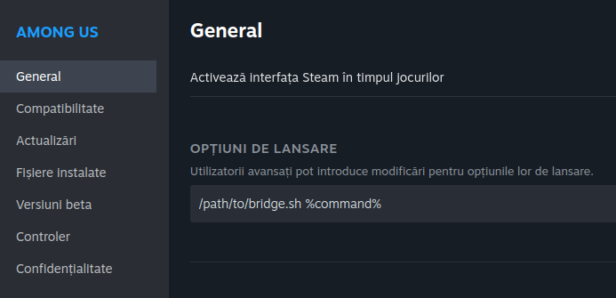

# Beta macos fix
# Discord RPC Bridge for Wine

Simple bridge that allows you to use Discord Rich Presence with Wine games/software.

Works by running a small program in the background that creates a [named pipe](https://learn.microsoft.com/en-us/windows/win32/ipc/named-pipes) `\\.\pipe\discord-ipc-0` inside the prefix and forwards all data to the pipe `/run/user/1000/discord-ipc-0`.

This bridge takes advantage of the Windows service implementation in Wine, eliminating the need to manually run any programs.

---

## Installation & Usage

Installation will copy itself to `C:\windows\bridge.exe` and create a Windows service.  
Logs are stored in `C:\windows\logs\bridge.log`.

#### Installing inside a prefix

##### Wine (~/.wine)

- Double click `bridge.exe` and click `Install`.
    - 
- To remove, the same process can be followed, but click `Remove` instead.

##### Lutris

- Click on a game and select `Run EXE inside Wine prefix`.
    - 
- The same process can be followed as in Wine.

##### Steam

- Right click on the game and select `Properties`.
- Under `Set Launch Options`, add the following:
    - 
- The `bridge.sh` script must be in the same directory as `bridge.exe`.

#### If you use Flatpak

- If you are running Steam, Lutris, etc in a Flatpak, you will need to allow the bridge to access the `/run/user/1000/discord-ipc-0` file.
	- ##### By using [Flatseal](https://flathub.org/apps/details/com.github.tchx84.Flatseal)
		- Add `xdg-run/discord-ipc-0` under `Filesystems` category
			- 
	- ##### By using the terminal
		- Per application
			- `flatpak override --filesystem=xdg-run/discord-ipc-0 <flatpak app name>`
		- Globally
			- `flatpak override --user --filesystem=xdg-run/discord-ipc-0`

## macOS

The steps to install are almost the same. The only difference is that if you want the service to work, you will have to use [this script](build/launchd.sh) to install a launch agent that will symlink the `$TMPDIR` to a static path (`/tmp/rpc-bridge/tmpdir`).
To do so, download it, make it executable (`chmod +x launchd.sh`) and run `./launchd.sh install`. You can uninstall the agent by running `./launchd.sh uninstall`.

## Compiling from source

- Install the `wine`, `gcc-mingw-w64` and `make` packages.
- Open a terminal in the directory that contains this file and run `make`.
- The compiled executable will be located in `build/bridge.exe`.

## Credits

This project is inspired by [wine-discord-ipc-bridge](https://github.com/0e4ef622/wine-discord-ipc-bridge).

---
