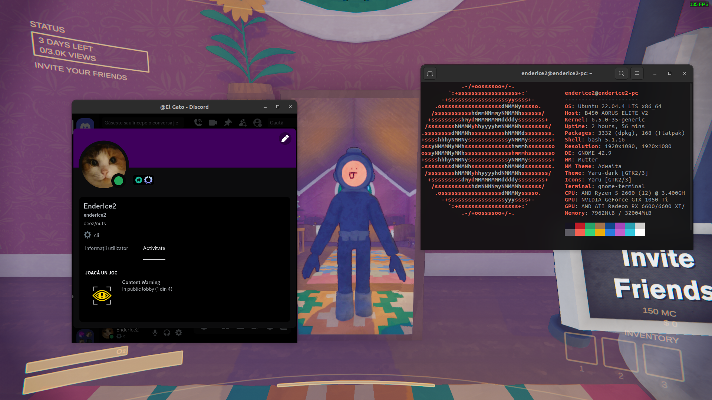
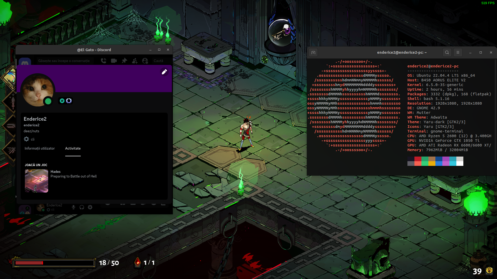
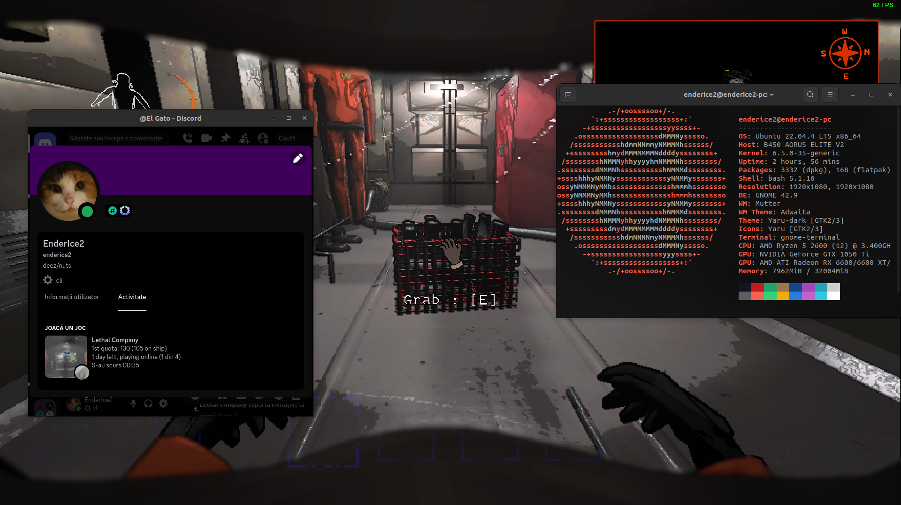
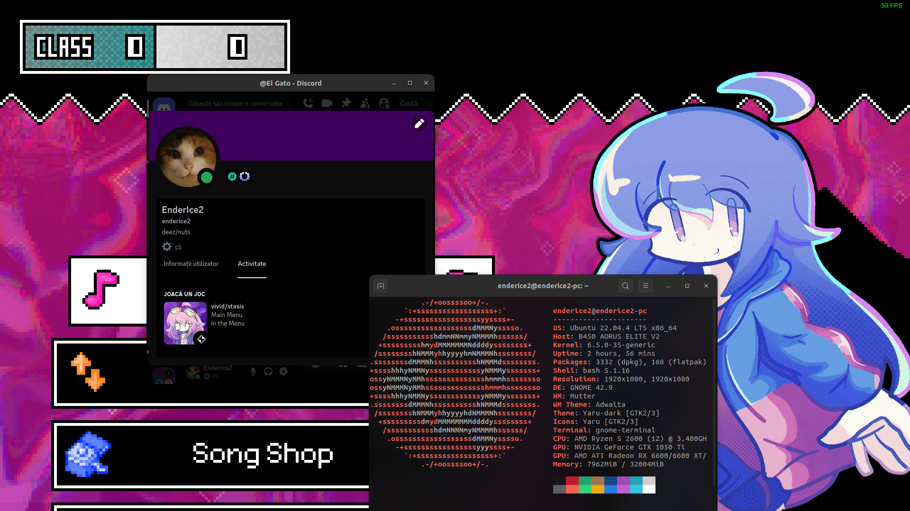

# Discord RPC Bridge for Wine

Simple bridge that allows you to use Discord Rich Presence with Wine games/software on Linux/macOS.

[Download latest release](https://github.com/EnderIce2/rpc-bridge/releases/latest/download/bridge.zip "Recommended"){ .md-button .md-button--primary }
[Download latest pre-release](https://github.com/EnderIce2/rpc-bridge/releases "Unstable builds with experimental features"){ .md-button }
[Download latest build](https://github.com/EnderIce2/rpc-bridge/actions/workflows/build.yml "Builds from the latest commits, here be dragons!"){ .md-button }

Works by running a small program in the background that creates a [named pipe](https://learn.microsoft.com/en-us/windows/win32/ipc/named-pipes) `\\.\pipe\discord-ipc-0` inside the prefix and forwards all data to the pipe `/run/user/1000/discord-ipc-0`.

This bridge takes advantage of the Windows service implementation in Wine, eliminating the need to run it manually.

These docs are for the latest stable release.  
For v1.0, see [the original README](https://github.com/EnderIce2/rpc-bridge/blob/v1.0/README.md).

---

## Known Issues

- If you use **Vesktop**
  Some games may not show up in Discord. This is because Vesktop uses arRPC, which it doesn't work with some games [#4](https://github.com/EnderIce2/rpc-bridge/issues/4#issuecomment-2143549407). This is not an issue with the bridge.

---

## My game is not showing up in Discord

If your game is not showing up in Discord, please check the following:

- The game you are playing has [Rich Presence](https://discord.com/developers/docs/rich-presence/overview) support!
    - Some games may not have this feature. It's up to developers of the game to implement it.  
    This is not an issue related to the bridge.

- You followed the installation steps correctly.

- You are using the latest version of the bridge. Currently is .

### I still want to see the game in Discord!

This is outside the scope of this project, but here are some workarounds:

- You can manually add the game to Discord by going to `User Settings >` under `Activity Settings` in `Registered Games` tab. [Official Article](https://support.discord.com/hc/en-us/articles/7931156448919-Activity-Status-Recent-Activity#h_01HTJA8QV5ABSA6FY6GEPMA946)
    - Tip: You can rename the game to whatever you want.

---

## Compiling from source

- Install the `wine`, `gcc-mingw-w64` and `make` packages.
- Open a terminal in the directory that contains this file and run `make`.
- The compiled executable will be located in `build/bridge.exe`.

---

## Examples

[**League Of Legends**](https://www.leagueoflegends.com/en-us/) running under Wine using Lutris  
{ width="600" }

[**Among Us**](https://store.steampowered.com/app/945360/Among_Us/) on Steam  
{ width="600" }

[**Content Warning**](https://store.steampowered.com/app/2881650/Content_Warning/) on Steam  
{ width="600" }

[**Hades**](https://store.steampowered.com/app/1145360/Hades/) on Steam  
{ width="600" }

[**Lethal Company**](https://store.steampowered.com/app/1966720/Lethal_Company/) ([modded](https://thunderstore.io/c/lethal-company/p/mrov/LethalRichPresence/)) on Steam  
{ width="600" }

[**vivid/stasis**](https://store.steampowered.com/app/2093940/vividstasis/) on Steam  
{ width="600" }

## Credits

This project is inspired by [wine-discord-ipc-bridge](https://github.com/0e4ef622/wine-discord-ipc-bridge).

---
