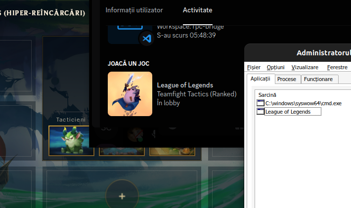
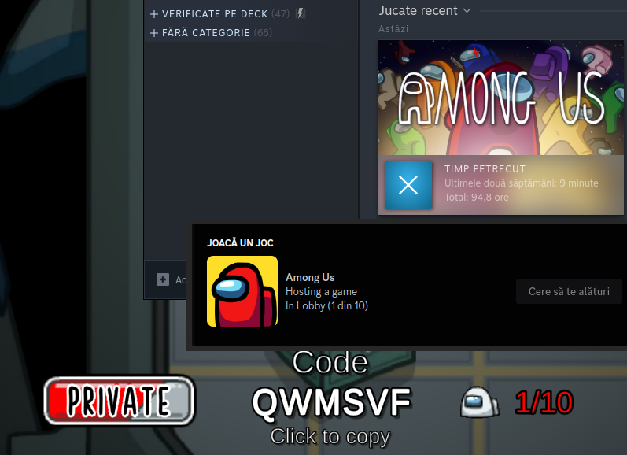

# Discord RPC Bridge for Wine

Simple bridge that allows you to use Discord Rich Presence with Wine games/software on Linux/macOS.

[Download latest release](https://github.com/EnderIce2/rpc-bridge/releases/latest/download/bridge.zip "Recommended"){ .md-button .md-button--primary }
[Download latest pre-release](https://github.com/EnderIce2/rpc-bridge/releases "Unstable builds with experimental features"){ .md-button }
<!-- [Download latest build](https://github.com/EnderIce2/rpc-bridge/actions "Builds from the latest commits, here be dragons!"){ .md-button } -->

Works by running a small program in the background that creates a [named pipe](https://learn.microsoft.com/en-us/windows/win32/ipc/named-pipes) `\\.\pipe\discord-ipc-0` inside the prefix and forwards all data to the pipe `/run/user/1000/discord-ipc-0`.

This bridge takes advantage of the Windows service implementation in Wine, eliminating the need to run it manually.

These docs are for the latest stable release.  
For v1.0, see [the original README](https://github.com/EnderIce2/rpc-bridge/blob/v1.0/README.md).

---

## Examples

{ width="600" }

{ width="600" }

## Credits

This project is inspired by [wine-discord-ipc-bridge](https://github.com/0e4ef622/wine-discord-ipc-bridge).

---
