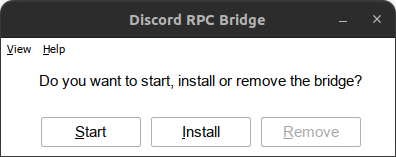
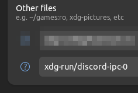

# Installation

Installation will copy itself to `C:\windows\bridge.exe` and create a Windows service.  
Logs are stored in `C:\windows\logs\bridge.log`.

## Installing inside a prefix

### Wine (~/.wine)

- Double click `bridge.exe` and click `Install`.
    - 
- To remove, the same process can be followed, but click `Remove` instead.

### Lutris

- Click on a game and select `Run EXE inside Wine prefix`.
    - 
- The same process can be followed as in Wine.

### Steam

There are two ways to install the bridge on Steam.

#### Using bridge.sh[^1]

This method is recommended because it's easier to manage.

- Right click on the game and select `Properties`.
- Under `Set Launch Options`, add the following:
    -   
Of course, you need to replace `/path/to/bridge.sh` with the actual path to the script.

!!! info "Note"

    `bridge.sh` must be in the same directory as `bridge.exe`.

#### Using Protontricks

- Open [Protontricks](https://github.com/Matoking/protontricks) and select the game you want to install the bridge to.
- Select `Select the default wineprefix`
- Select `Browse files` and copy contents of `build` to the game's prefix `drive_c`
- Select `Run a Wine cmd shell` and run `C:\> install.bat`
    - If you are not in `C:\`, type `c:` and press enter

, use it instead!")

!!! warning "If you use Flatpak"

    If you are running Steam, Lutris, etc in a Flatpak, you will need to allow the bridge to access the `/run/user/1000/discord-ipc-0` file.

    You can do this by using [Flatseal](https://flathub.org/apps/details/com.github.tchx84.Flatseal) or the terminal.

    === "Flatseal"
    
        Add `xdg-run/discord-ipc-0` under `Filesystems` category  
        

    === "Terminal"

        - Per application
            - `flatpak override --filesystem=xdg-run/discord-ipc-0 <flatpak app name>`
        - Globally
            - `flatpak override --user --filesystem=xdg-run/discord-ipc-0`

## macOS

The steps for MacOS are almost the same, but due to the way `$TMPDIR` works, you will have to install a **LaunchAgent**.

- Download the latest build from the [releases](https://github.com/EnderIce2/rpc-bridge/releases)
- Open the archive and make the `launchd.sh` script executable by doing: `chmod +x launchd.sh`
- To **install** the LaunchAgent, run `./launchd install` and to **remove** it simply run `./launchd remove`.

The script will add a LaunchAgent to your user, that will symlink the `$TMPDIR` directory to `/tmp/rpc-bridge/tmpdir`.

!!! info "Note"
    You will need to launch the `bridge.exe` file manually in Wine at least once for it to register and launch automatically the next time.

## Run without installing the service

If you prefer not to use the service, you can manually run `bridge.exe` within the Wine prefix.  
This method is compatible with both Wine and Lutris.

In Lutris, you can achieve this by adding the path to `bridge.exe` in the `Executable` field under `Game options`. In `Arguments` field, be sure to include the _Windows_ path to the game's executable.

=== "Without bridge"

        - Executable
            - `/mnt/games/lutris/league-of-legends/drive_c/Riot Games/League of Legends/LeagueClient.exe`
        - Arguments
            - `--locale=en_US --launch-product=league_of_legends --launch-patchline=live`

=== "With bridge"

        - Executable
            - `/mnt/games/lutris/league-of-legends/drive_c/bridge.exe`
        - Arguments
            - `"C:\Riot Games\League of Legends\LeagueClient.exe" --locale=en_US --launch-product=league_of_legends --launch-patchline=live`

In Wine, all you need to do is run `bridge.exe` and select `Start`.

## Compiling from source

- Install the `wine`, `gcc-mingw-w64` and `make` packages.
- Open a terminal in the directory that contains this file and run `make`.
- The compiled executable will be located in `build/bridge.exe`.

[^1]: As requested [here](https://github.com/EnderIce2/rpc-bridge/issues/2).
