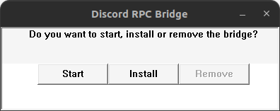
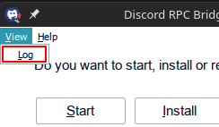

# Usage

## GUI

- When running the program manually without providing any arguments it will show a GUI.

- `Start` will start the service without installing itself.
- `Install`/`Update` will install or update the service.
- `Remove` will uninstall the service.

## CLI

- `--help` Show help message
    - Show the help message

- `--version` Show version
    - Show the version of the program

- `--install` Install the service
    - Copy the binary to `C:\windows\bridge.exe` and register it as a service

- `--uninstall` Uninstall the service
    - Remove the service and delete `C:\windows\bridge.exe`

- `--steam` Reserved for Steam
    - Start the service and exit (used with `bridge.sh`)

- `--no-service` Do not run as service
    - (only for `--steam`)

- `--service` Reserved for service
    - Reserved

- `--rpc <dir>` Set RPC_PATH environment variable
    - Used to specify the directory where `discord-ipc-0` is located

## Environment Variables

- `BRIDGE_RPC_PATH`
    - Specifies the directory where `discord-ipc-0` is located

## Accessing the logs

Logs are stored in `C:\windows\logs\bridge.log` and from GUI can be accessed from the `View` > `Logs` tab.

